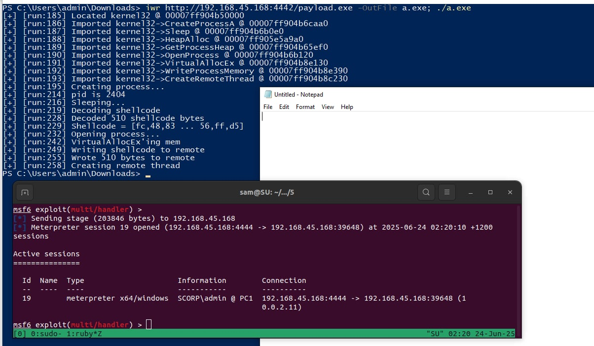

# Start Your Own Process Loader (aka SYOP Loader)

This is a proof-of-concept shellcode loader that compiles to PIC shellcode. It starts a sacrificial process (notepad.exe) before injecting something bad (ie meterpreter) into it.

This should bypass some signature hits for Defender if you are trying to load something sketchy. It has been proven to be better than a simple VirtualAlloc/CreateThread shellcode loader that loads into the current process

*The build toolchain, PE tricks and entire project is based on [c-to-shellcode](https://github.com/Print3M/c-to-shellcode)*

## Setup
```sh
# Check mingw (mine is 10-win32 20220113)
x86_64-w64-mingw32-gcc-win32 --version
```

## Building
```sh
python3 compile.py
```
This will produce three files in the `bin` directory:

- `payload.bin` - Position independent shellcode of the loader
- `payload.exe` - Debug version of the loader that is linked as a normal exe and with logging
- `loader_exe.exe` - An example exe which you can use for testing the loader shellcode. It will load and execute the same shellcode within `payload.bin`.
- `loader_svc.exe` - Same as `loader_exe` but behaves as a Windows service (for loading and testing your shellcode)

# Example

